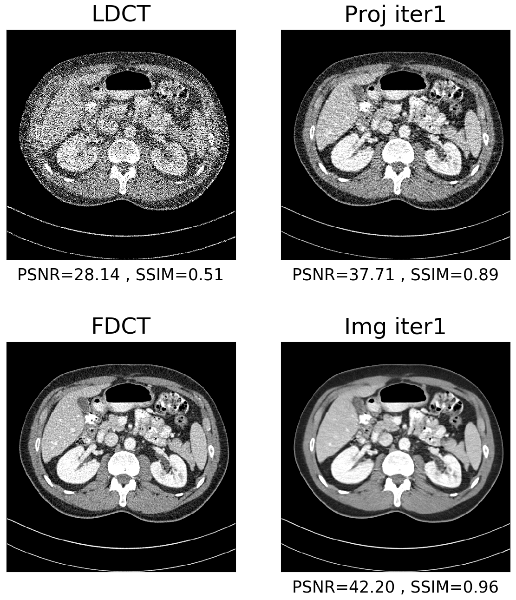

Official implementation of paper  "Domain Progressive Low-dose CT Imaging using Iterative Partial Diffusion Model"


# IPDM usage guidance
First, please organize your datasets following the directory structure of the example dataset.
```
E:
├─0.25dose
│  ├─image domain
│  │  ├─L067
│  │  │      L067_FD_1_1.CT.0001.0001.2015.12.22.18.09.40.840353.358074219.IMA.npy  
│  │  │      ............
│  │  └─L109
│  │         L109_FD_1_1.CT.0001.0001.2015.12.23.17.52.25.829117.125758448.IMA.npy
│  │         ............
│  └─projection domain
│      ├─L067
│      │     L067_FD_1_1.CT.0001.0001.2015.12.22.18.09.40.840353.358074219.IMA.npy
│      │      ............
│      └─L109
│            L109_FD_1_1.CT.0001.0001.2015.12.23.17.52.25.829117.125758448.IMA.npy
│            ............
└─ND
    ├─image domain
    │  ├─L067
    │  │     L067_FD_1_1.CT.0001.0001.2015.12.22.18.09.40.840353.358074219.IMA.npy
    │  │      ............
    │  └─L109
    │        L109_FD_1_1.CT.0001.0001.2015.12.23.17.52.25.829117.125758448.IMA.npy
    │        ............
    └─projection domain
        ├─L067
        │    L067_FD_1_1.CT.0001.0001.2015.12.22.18.09.40.840353.358074219.IMA.npy
        │    ............
        └─L109
             L109_FD_1_1.CT.0001.0001.2015.12.23.17.52.25.829117.125758448.IMA.npy
             ............
```
### Runtime Environment: pytorch 1.7.1+cu110, libtorch 1.7.1+cu110, i9-13900K+RTX4090
### Test Samples
1. Download the example dataset from <https://drive.google.com/file/d/11kI1Mfmqashfc4nHDsZJqbTMGaLJaJRc/view?usp=sharing> and store it in `Dataset/test sample`. Download the pretrained model parameters from <https://drive.google.com/drive/folders/1-40NWVM3ng8Ty-auqO5YE_Rj3Xv1jZlA?usp=sharing> and store it in `\Pretrained Params`. 
2. Open `test_sample.ipynb` and run the code blocks in the jupyter notebook sequentially. To change the sample, simply modify the `idx=15` to other index
in the second code block. Example sample denoising result is as follows:



### Training on your own dataset
1. Prepare the training dataset, including: Image Domain NDCT + Projection Domain NDCT. 
Prepare the test dataset, including: Image Domain NDCT + Image Domain LDCT + Projection Domain NDCT + Projection Domain LDCT.
2. Modify the following code in `Dataset/npz_data_loader.py` according to the data file names to ensure 
that it can extract the case name and slice name.
```python    
def get_pname_sname(self, file_path):
        if self.patient_name is None:
            if self.data_type == "siemens":
                self.patient_name = list(map(lambda x: x.split("\\")[-2], file_path))
                self.slice_name = list(map(lambda x: x.split("\\")[-1].split(".")[0], file_path))
            elif self.data_type == "mayo":
                self.patient_name = list(map(lambda x: x.split("\\")[-2], file_path))
                self.slice_name = list(map(lambda x: x.split("\\")[-1].split(".")[-4], file_path))
```
#### Image Domain Training
3. Copy `Config/Mayo-Config/train_img_option.json` and modify the path parameters `"train_dataset_path_FD_img"`, `"train_dataset_path_FD_img"` 
to your own training data paths, and `"test_dataset_path_FD_img"`, `"test_dataset_path_LD_img"`, `"test_dataset_path_FD_proj"`, `"test_dataset_path_LD_proj"` to your own test data paths.
```json 
"data_type": "mayo",
"train_dataset_path_FD_img": "F:/ddpm_mayo/train/ND/image domain",
"train_dataset_path_LD_img": null,
"train_dataset_path_FD_img": "F:/ddpm_mayo/train/ND/projection domain",
"train_dataset_path_LD_proj": null,
"test_dataset_path_FD_img":  "F:/ddpm_mayo/test/ND/image domain",
"test_dataset_path_LD_img":  "F:/ddpm_mayo/test/0.25dose/image domain",
"test_dataset_path_FD_proj": "F:/ddpm_mayo/test/ND/projection domain",
"test_dataset_path_LD_proj": "F:/ddpm_mayo/test/0.25dose/projection domain",
```
4. Adjust the training and testing parameters in `Config/Mayo-Config/train_img_option.json`. 
It is recommended to use the default values. The meaning of each parameter is explained in detail in `Config/default_config.py`.
5. Open cmd, navigate to the directory containing `main.py`, and run:
```cmd
python main.py --load_option_path Config/Mayo-Config/train_img_option.json
```
6. To track training progress, find the log path and use TensorBoard by running in cmd, such as:
```cmd
tensorboard --logdir Utils/ModelTrainLog/IPDM_train_Mayo_img/2024-08-15T16-54-23/trainSummary
```
#### Projection Domain Training
7. The process is almost the same as for Image Domain Training. Copy `Config/Mayo-Config/train_proj_option.json` and modify the path parameters and training/testing parameters.
8. Open cmd, navigate to the directory containing `main.py`, and run:
```cmd
python main.py --load_option_path Config/Mayo-Config/train_proj_option.json
```


### Testing on your own dataset
1. Copy `Config/Mayo-Config/test_progressive_option.json` and modify the test dataset paths to your own test data paths:
